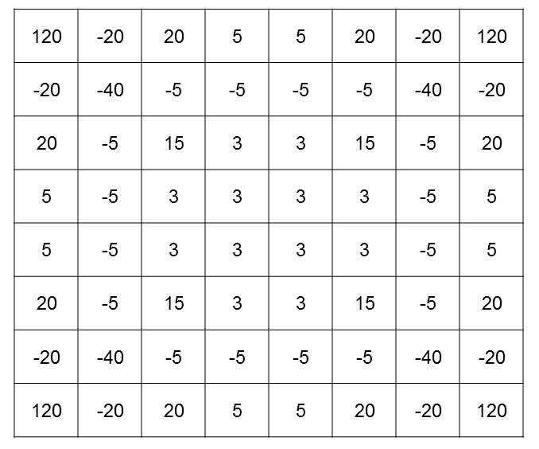

# Othello AI Minimax Implementation in Java
## Table of Contents

  * [🗺️ Overview](#%EF%B8%8F-overview)
  * [🤖 Explanation of Minimax](#%EF%B8%8F-design-and-test-verification)
  * [⚙️ Setup and How to Play](#%EF%B8%8F-specification-and-how-it-works)
  * [🙏 Acknowledgements](#%EF%B8%8F-design-and-test-verification)
  

## 🗺️ Overview

> Reversi is a turn-based strategy board game involving 2 players who play black and white disks on an 8x8 board. The players take turns placing disks on the board with their assigned color facing up. During a play, any disks of the opponent's color that are in a straight line and bounded by the disk just placed and another disk of the current player's color are turned over to the current player's color. The objective of the game is to have the majority of disks turned to display one's color when the last playable empty square is filled.
>
> -- <cite>[Wikipedia](https://en.wikipedia.org/wiki/Reversi)</cite>

## 🤖 Explanation of Minimax

### What is Minimax?
- Minimax is a decision rule used in a variety of applications (artificial intelligence, game theory, statistic etc) which aims to minimise the possible loss whilst also maximising the possible gain for a worst-case scenario.
- The minimax algorithm is a recursive algorithm which applies this rule, and the goal of the algorithm is to choose the best move out of its calculated possible set of moves. 
- What is determined as the 'best' move is dictated by the value of the move - this value is retrieved by some position evaluation function which indicates how good it would be for a player to reach that position.

### How the Minimax Algorithm is used in this game
The Minimax Algorithm is used as the decision-making procedure for the AI that the player plays against. The human player plays with the black pieces and is referred to as the 'minimising player' - this player aims to make moves such that the position evaluation function returns the lowest possible value (i.e. 'minimising' the evaluation) whilst the AI plays as the 'maximising player', and aims to maximise the evaluation to make it return the highest possible value. Thus, the AI will choose the moves with the highest evaluations given by the minimax algorithm.

### Simplified explanation of the algorithm
The algorithm has a depth parameter D which dictates how 'far' the algorithm is able to look ahead in the game. Player B makes a move and now it's Player W's (the AI) turn to move. The algorithm computes all the possible moves given the current state in the game. For each possible move, 'simulate' the resulting state of the game based on the move. In the simulated state, it would be Player B's turn to move - the algorithm also computes all of the possible moves for Player B given this simulate state. Recursively simulate each move for each player until either: we reach the depth of our search or the simulated move would end the game. Once we reach this point, calculate the position evaluation for this simulated board state. We can then backtrack from this simulated board state and compute all of the evaluations for the prior moves that led to this state until we reach the current board state. In the current board state, Player W has a set of moves that it can make, with each move now having an evaluation attached to it. Player W is the maximising player, so it will choose the move that has the highest evaluation.

### Position evaluation function
The value of a move is given by a position evaluation function. In this implementation, an 8x8 static evaluation table is used as a crude but simple approach to the 'current state of the board'. Each position in the table contains a fixed value (essentially a 'weight) , which represents how good or bad it is for a piece to hold this position on the board.



The intuition behind this table of values is as follows:

- Pieces on the edge of the board are highly valued, pieces here are hard to take
- Pieces in the corners have the highest value, it is impossible to replace this piece
- Pieces surrounding the high value spaces are low value as the opponent is able to move into a high-value position.

The evaluation of the current state of the board based on the current player is simply the summation of all the static evaluation values in positions that the current player occupies on the board.


## ⚙️ Setup and How to Play

To compile the code, use the following command:
```javac Othello.java```

To run the game, use the following command:
```java Othello```

## 🙏 Acknowledgements

- Dr Ian Pratt Hartmann for his lectures on the minimax algorithm and the base code for the game
